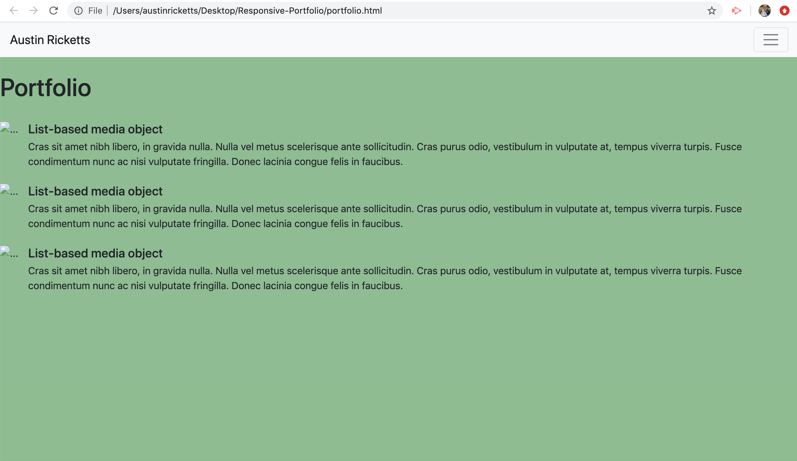
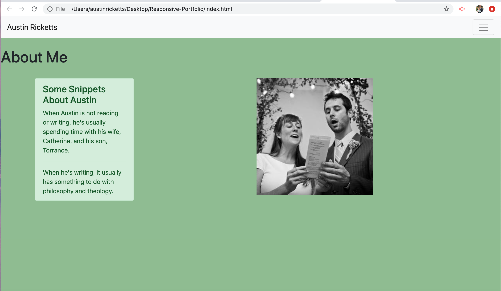
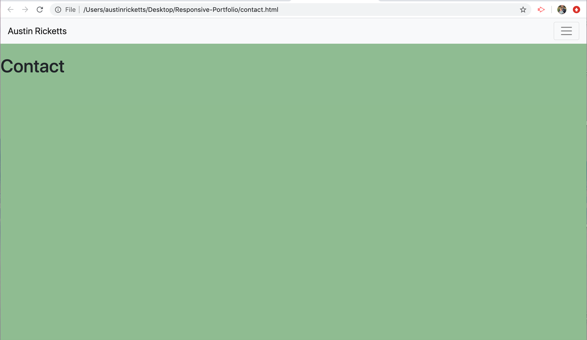
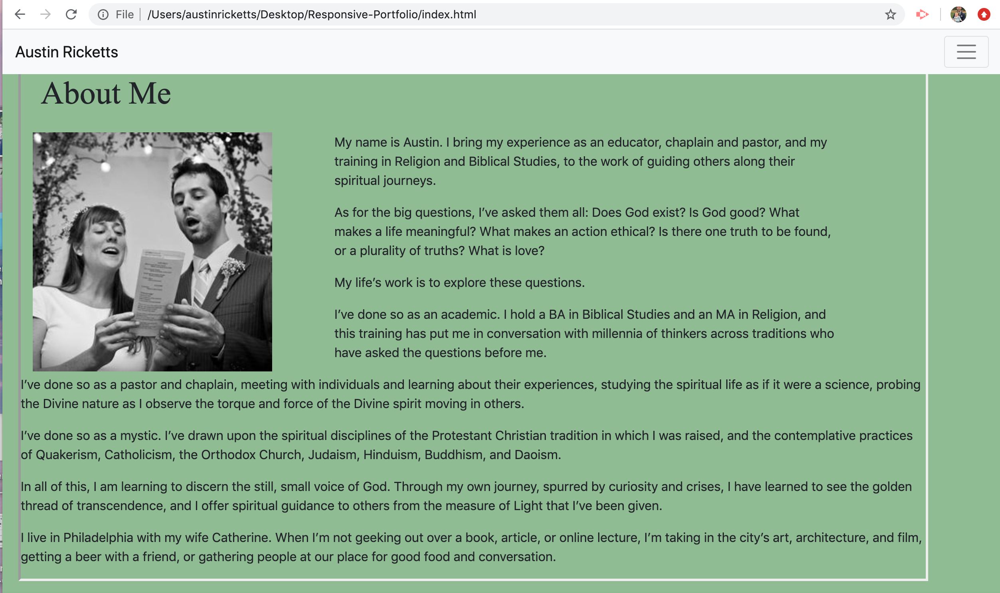
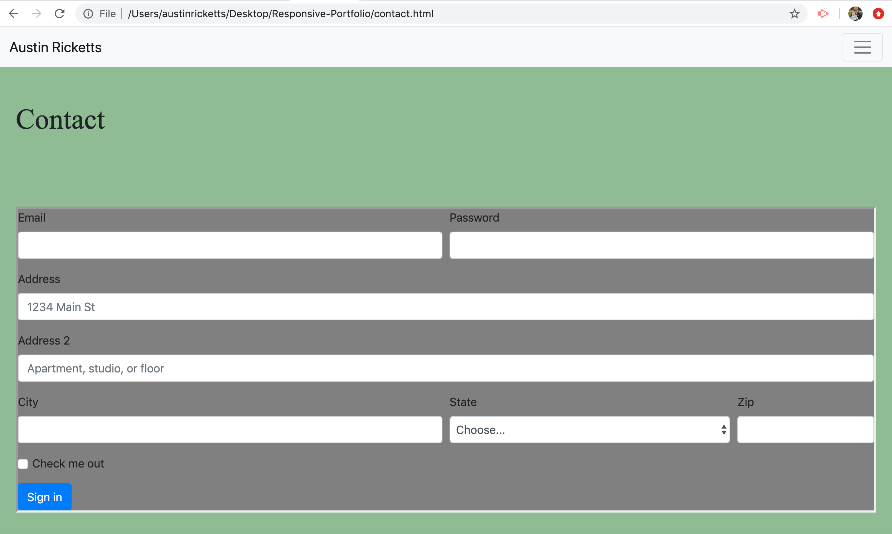
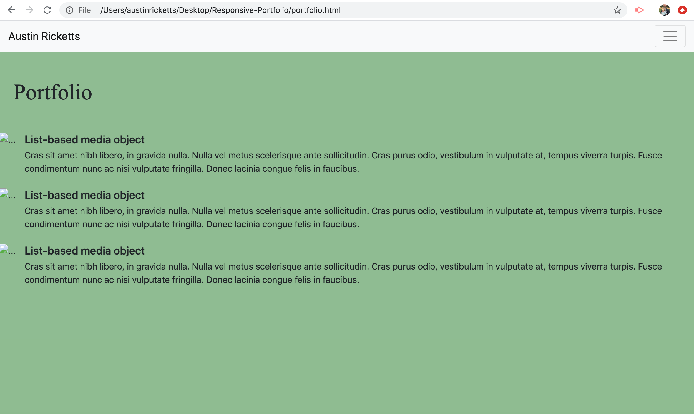
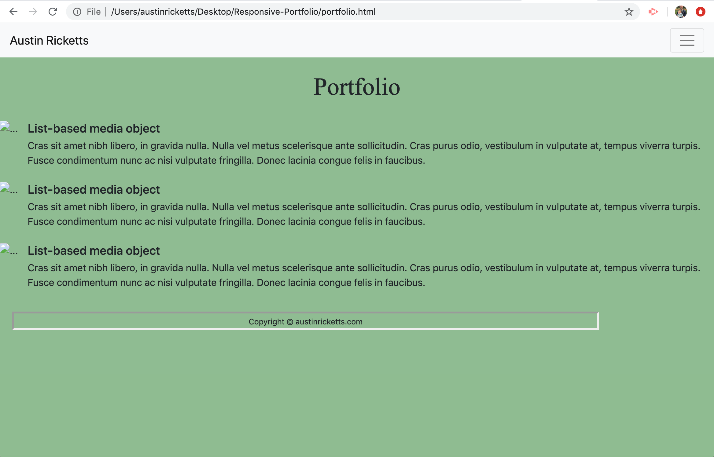
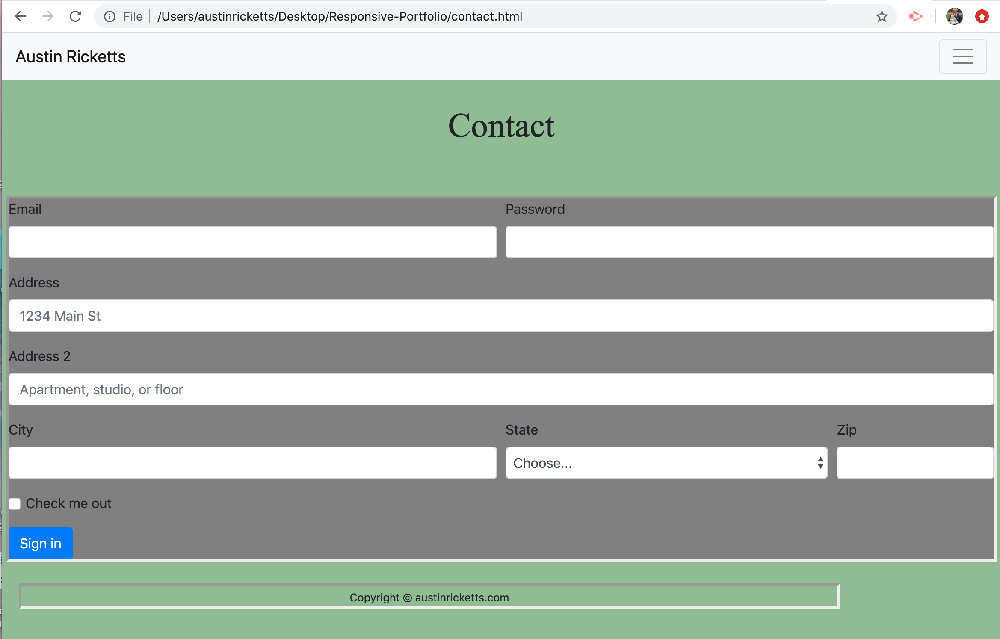
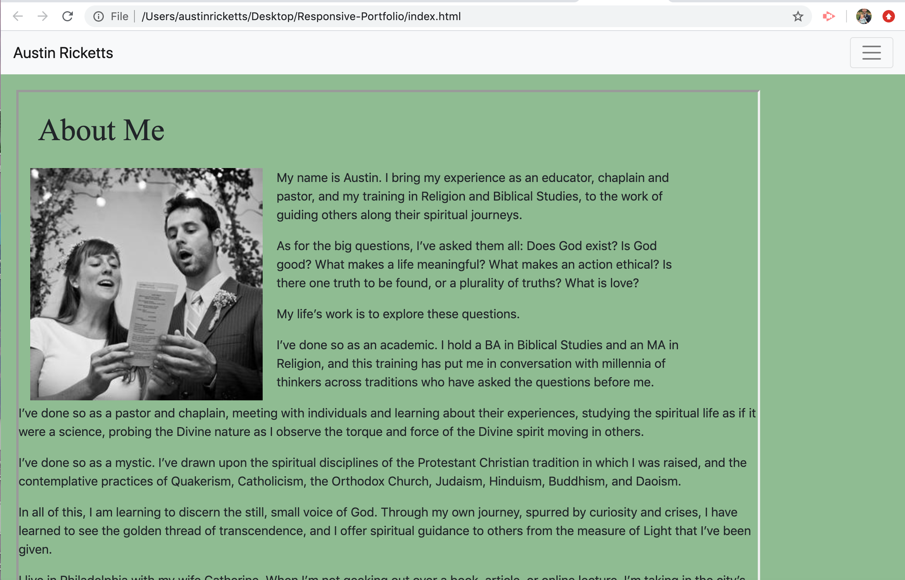
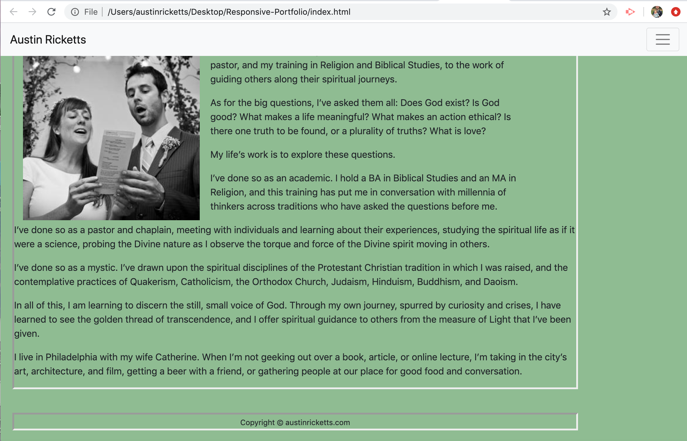

# Responsive-Portfolio

The above images are screenshots that show the progress of my site architecture.

The website itself was built largely using the grid system and the components from Bootstrap.com. The Footer was styled after a sticky footer found on startbootstrap.com. The background image was done using a code snippet styled from mdbootstrap.com. I was pointed in the direction of using a background image from my classmate, Joe Dvorak--a fine gentleman. 

All of the main commentary, which has to do with common changes across pages, will be found on the index.html page. Commentary specific to any given pages will be found on those pages.

The current purpose of this website is to initialize an online Portfolio. 

The index.html page contains an About Me section, focusing on philosophical/religious aspects of my current career. The text is currently in reference to that. It is subject to change as I progress in my coding skills and transition career goals toward computer programming.

The Contact page is non-functional, but it will be updated as the website continues to be built.

The Portfolio page is currently repetitive, but the images do have links that take the user to other website that are run by this writer.
